**缺二分图和匈牙利算法 哈希表 线性探测再散列**
图的连通性 广度优先 深度优先 单源最短路径 拓扑排序 最小生成树 ~~排序算法~~ 哈夫曼树 网络流 二分图 0—1背包 
回溯 分支限界

#模拟一

#模拟二

# 模拟三
## T1.1 排序算法
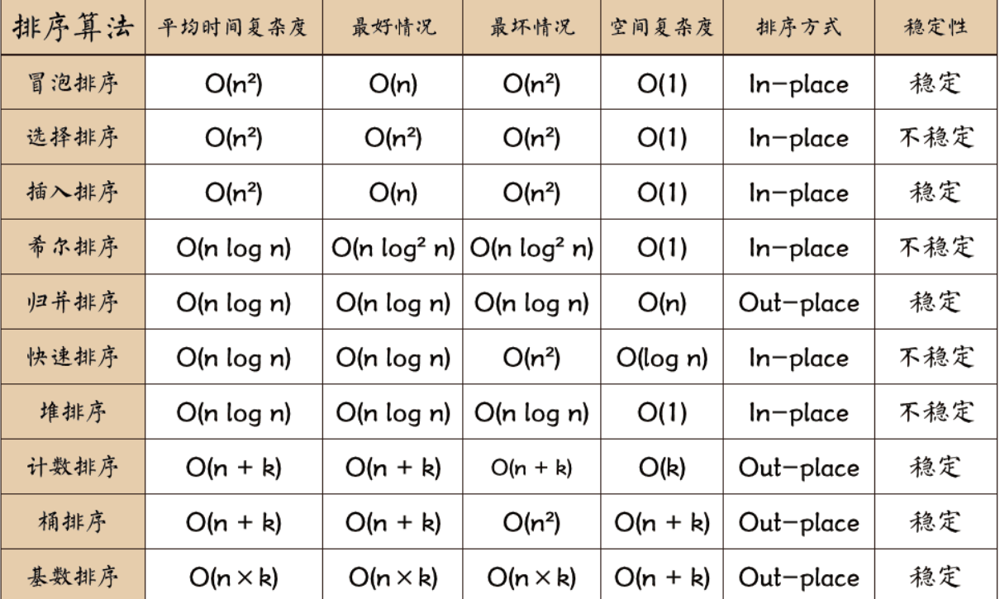

1. 冒泡，略 
``` c++
void bubble_sort(T arr[], int len) {
        int i, j;
        for (i = 0; i < len - 1; i++)
                for (j = 0; j < len - 1 - i; j++)
                        if (arr[j] > arr[j + 1])
                                swap(arr[j], arr[j + 1]);
}
```
2. 选择 : 选择排序基本思想是每次从待排序的数据中选择最小（或最大）的元素，放到已排序序列的末尾
``` C++
void selection_sort(std::vector<T>& arr) {
        for (int i = 0; i < arr.size() - 1; i++) {
                int min = i;
                for (int j = i + 1; j < arr.size(); j++)
                        if (arr[j] < arr[min])
                                min = j;
                std::swap(arr[i], arr[min]);
        }
}
```
优点：
实现简单，代码易于理解。
原地排序，不需要额外的存储空间。
对于小规模数据集，性能尚可接受。
缺点：
时间复杂度较高，不适合大规模数据集。
不稳定排序算法（如果存在相同元素，可能会改变它们的相对顺序）。

3. 插入排序 
    算法步骤：
    1. 初始化：将列表分为已排序部分和未排序部分。初始时，已排序部分只包含第一个元素，未排序部分包含剩余元素。
    2. 选择元素：从未排序部分中取出第一个元素。
    3. 插入到已排序部分：将该元素与已排序部分的元素从后向前依次比较，找到合适的位置插入。
    4. 重复步骤：重复上述步骤，直到未排序部分为空，列表完全有序。
``` c++
void insertion_sort(int arr[],int len){
        for(int i=1;i<len;i++){
                int key=arr[i];
                int j=i-1;
                while((j>=0) && (key<arr[j])){
                        arr[j+1]=arr[j];
                        j--;
                }
                arr[j+1]=key;
        }
}
```
优缺点
优点：
实现简单，代码易于理解。
对小规模数据或基本有序的数据效率较高。
原地排序，不需要额外的存储空间。
稳定排序算法（相同元素的相对顺序不会改变）。
缺点：
时间复杂度较高，不适合大规模数据集。

4. 希尔排序
``` c++
template<typename T>
void shell_sort(T array[], int length) {
    int h = 1;
    while (h < length / 3) {
        h = 3 * h + 1;
    }
    while (h >= 1) {
        for (int i = h; i < length; i++) {
            for (int j = i; j >= h && array[j] < array[j - h]; j -= h) {
                std::swap(array[j], array[j - h]);
            }
        }
        h = h / 3;
    }
}
```
优点：
相对于简单插入排序，效率更高。
原地排序，不需要额外的存储空间。
适用于中等规模的数据集。
缺点：
时间复杂度依赖于增量序列的选择。
不稳定排序算法（可能改变相同元素的相对顺序）。

5. 归并排序 不断分解 解决一个个小区间的问题 最后合并
``` c++
template<typename T> // 整數或浮點數皆可使用,若要使用物件(class)時必須設定"小於"(<)的運算子功能
void merge_sort(T arr[], int len) {
    T *a = arr;
    T *b = new T[len];
    for (int seg = 1; seg < len; seg += seg) {
        for (int start = 0; start < len; start += seg + seg) {
            int low = start, mid = min(start + seg, len), high = min(start + seg + seg, len);
            int k = low;
            int start1 = low, end1 = mid;
            int start2 = mid, end2 = high;
            while (start1 < end1 && start2 < end2)
                b[k++] = a[start1] < a[start2] ? a[start1++] : a[start2++];
            while (start1 < end1)
                b[k++] = a[start1++];
            while (start2 < end2)
                b[k++] = a[start2++];
        }
        T *temp = a;
        a = b;
        b = temp;
    }
    if (a != arr) {
        for (int i = 0; i < len; i++)
            b[i] = a[i];
        b = a;
    }
    delete[] b;
}
```
优点：
时间复杂度稳定为 O(n log n)，适合大规模数据。
稳定排序算法（相同元素的相对顺序不会改变）。
适合外部排序（如对磁盘文件进行排序）。
缺点：
需要额外的存储空间，空间复杂度为 O(n)。
对于小规模数据，性能可能不如插入排序等简单算法。

6. 快速排序 
选择基准元素：从列表中选择一个元素作为基准（pivot）。选择方式可以是第一个元素、最后一个元素、中间元素或随机元素。
分区：将列表重新排列，使得所有小于基准元素的元素都在基准的左侧，所有大于基准元素的元素都在基准的右侧。基准元素的位置在分区完成后确定。
递归排序：对基准元素左侧和右侧的子列表分别递归地进行快速排序。
合并：由于分区操作是原地进行的，递归结束后整个列表已经有序。
```c++
struct Range {
    int start, end;
    Range(int s = 0, int e = 0) {
        start = s, end = e;
    }
};
template <typename T> // 整數或浮點數皆可使用,若要使用物件(class)時必須設定"小於"(<)、"大於"(>)、"不小於"(>=)的運算子功能
void quick_sort(T arr[], const int len) {
    if (len <= 0)
        return; // 避免len等於負值時宣告堆疊陣列當機
    // r[]模擬堆疊,p為數量,r[p++]為push,r[--p]為pop且取得元素
    Range r[len];
    int p = 0;
    r[p++] = Range(0, len - 1);
    while (p) {
        Range range = r[--p];
        if (range.start >= range.end)
            continue;
        T mid = arr[range.end];
        int left = range.start, right = range.end - 1;
        while (left < right) {
            while (arr[left] < mid && left < right) left++;
            while (arr[right] >= mid && left < right) right--;
            std::swap(arr[left], arr[right]);
        }
        if (arr[left] >= arr[range.end])
            std::swap(arr[left], arr[range.end]);
        else
            left++;
        r[p++] = Range(range.start, left - 1);
        r[p++] = Range(left + 1, range.end);
    }
}
```
时间复杂度稳定为 O(n log n)，适合大规模数据。
稳定排序算法（相同元素的相对顺序不会改变）。
适合外部排序（如对磁盘文件进行排序）。
缺点：
需要额外的存储空间，空间复杂度为 O(n)。
对于小规模数据，性能可能不如插入排序等简单算法。

7. 堆排序
堆排序（Heapsort）是指利用堆这种数据结构所设计的一种排序算法。堆积是一个近似完全二叉树的结构，并同时满足堆积的性质：即子结点的键值或索引总是小于（或者大于）它的父节点。堆排序可以说是一种利用堆的概念来排序的选择排序。分为两种方法：
大顶堆：每个节点的值都大于或等于其子节点的值，在堆排序算法中用于升序排列；
小顶堆：每个节点的值都小于或等于其子节点的值，在堆排序算法中用于降序排列；
堆排序的平均时间复杂度为 Ο(nlogn)。
**算法步骤**
创建一个堆 H[0……n-1]；
把堆首（最大值）和堆尾互换；
把堆的尺寸缩小 1，并调用 shift_down(0)，目的是把新的数组顶端数据调整到相应位置；
重复步骤 2，直到堆的尺寸为 1。

8. 计数排序 ： 就是计算一个特定区间内的 数字 出现的次数
计数排序（Counting Sort）是一种非比较型的排序算法，适用于对整数或有限范围内的数据进行排序。它的核心思想是通过统计每个元素的出现次数，然后根据统计结果将元素放回正确的位置。计数排序的时间复杂度为 O(n + k)，其中 n 是待排序元素的数量，k 是数据的范围大小。
计数排序的核心在于将输入的数据值转化为键存储在额外开辟的数组空间中。作为一种线性时间复杂度的排序，计数排序要求输入的数据必须是有确定范围的整数。
优点：
时间复杂度为 O(n + k)，当 k 较小时，性能优异。
稳定排序算法（相同元素的相对顺序不会改变）。
缺点：
仅适用于整数或有限范围内的数据。
当数据范围 k 很大时，空间复杂度较高。

9. 桶排序
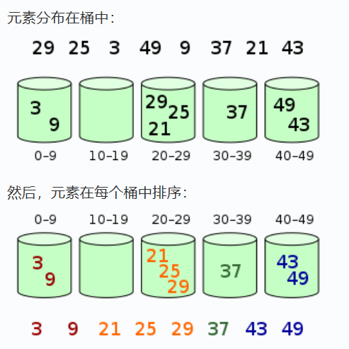
假设有一个待排序的列表 [0.42, 0.32, 0.33, 0.52, 0.37, 0.47, 0.51]，桶排序的过程如下：
初始化桶：
假设数据范围是 [0, 1)，创建 10 个桶，每个桶的范围为 0.1。
桶 0：[0.0, 0.1)
桶 1：[0.1, 0.2)
...
桶 9：[0.9, 1.0)
分配元素：
遍历列表，将元素分配到对应的桶中：
0.42 → 桶 4
0.32 → 桶 3
0.33 → 桶 3
0.52 → 桶 5
0.37 → 桶 3
0.47 → 桶 4
0.51 → 桶 5
分配后的桶：
桶 3：[0.32, 0.33, 0.37]
桶 4：[0.42, 0.47]
桶 5：[0.52, 0.51]
排序每个桶：
对每个桶中的元素进行排序：
桶 3：[0.32, 0.33, 0.37]（已经有序）。
桶 4：[0.42, 0.47]（已经有序）。
桶 5：[0.51, 0.52]（排序后）。
合并桶：
按顺序合并所有桶中的元素：
桶 3：[0.32, 0.33, 0.37]
桶 4：[0.42, 0.47]
桶 5：[0.51, 0.52]
合并后的列表：[0.32, 0.33, 0.37, 0.42, 0.47, 0.51, 0.52]。

10.  基数排序
**变量解释：设待排序的数组R[1..n]，数组中最大的数是d位数，基数为r（如基数为10，即10进制，最大有10种可能，即最多需要10个桶来映射数组元素）** 对应模拟五 T1.2

基数排序（Radix Sort）是一种非比较型的排序算法，它通过逐位比较元素的每一位（从最低位到最高位）来实现排序。基数排序的核心思想是将整数按位数切割成不同的数字，然后按每个位数分别进行排序。基数排序的时间复杂度为 O(n * k)，其中 n 是列表长度，k 是最大数字的位数。
算法步骤：
确定最大位数：找到列表中最大数字的位数，确定需要排序的轮数。
按位排序：从最低位开始，依次对每一位进行排序（通常使用计数排序或桶排序作为子排序算法）。
合并结果：每一轮排序后，更新列表的顺序，直到所有位数排序完成。
**基数排序 vs 计数排序 vs 桶排序**
基数排序有两种方法：
这三种排序算法都利用了桶的概念，但对桶的使用方法上有明显差异：
基数排序：根据键值的每位数字来分配桶；
计数排序：每个桶只存储单一键值；
桶排序：每个桶存储一定范围的数值；

## T1.3
对线性表，在下列哪种情况下应当采用链表表示？<mark>（A）</mark>
A）经常需要随机地存取元素
B）经常需要进行插入和删除操作
C）表中元素需要占据一片连续的存储空间
D）表中元素的个数不变

## T1.6 
采用开放定址法处理散列表的冲突时，其平均查找长度<mark>（B）</mark>
A）低于链接法处理冲突
B）高于链接法处理冲突
C）与链接法处理冲突相同
D）高于二分查找

## T1.10 二叉树搜索树
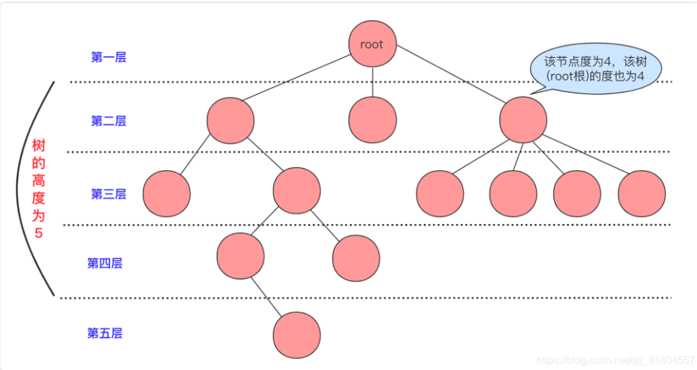
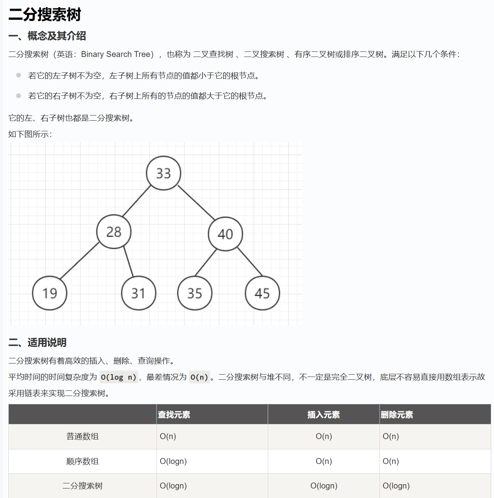


## T2 最小生成树
我们定义无向连通图的 最小生成树（Minimum Spanning Tree，MST）为边权和最小的生成树。
注意：只有连通图才有生成树，而对于非连通图，只存在生成森林。
**看书 书挺详细的 P163&P165**
prim ： 该算法的基本思想就是找每个根结点及其子节点的最小边，保留最小的能生成最小生成树的边，注意顺序。
kruskal： 该算法的基本思想是从小到大加入边，已连接就删掉，是个贪心算法。

eg 顶点集 $V = \{1, 2, 3, 4, 5, 6, 7\}$
边集 $E = \{(1, 2)3, (1, 3)5, (1,4)8, (2, 5)10, (2, 3)6, (3, 4)15, (3, 5)12, (3, 6)9, (4, 6)4, (4, 7)20, (5, 6)18, (6, 7)25\}$
用克鲁斯卡尔算法得到的最小生成树为：
(1, 2)3, (4, 6)4, (1, 3)5, (1, 4)8, (2, 5)10, (4, 7)20

## T3 邻接矩阵 邻接表
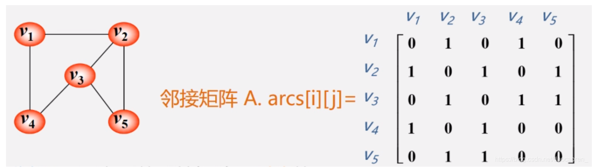
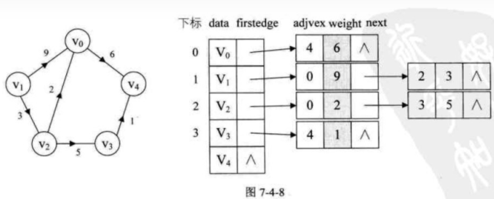
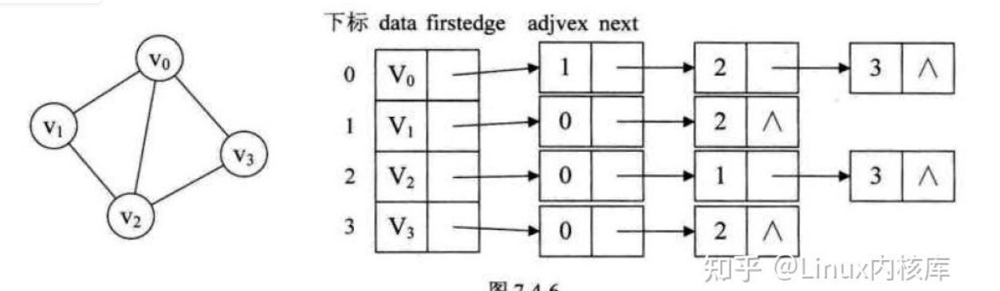
邻接表指向目标点一一条边内的点

## T4 aoe网 关键路径
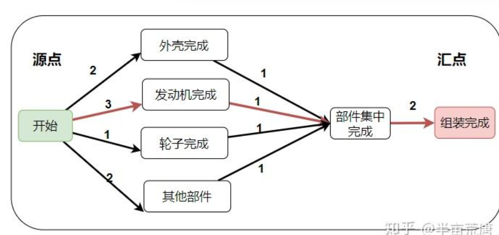
<mark>不止一条！！！</mark>


## T5 有向树 无向树
一棵非空的有向树中恰有一个顶点入度为0，其他顶点入度为1。但一个恰有一个顶
点入度为0、其他顶点入度为1的<mark>有向图</mark>却不一定是一棵有向树。请举例说明之。
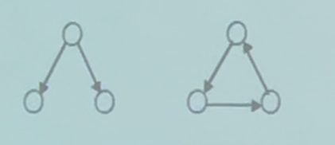
左边是有向树 右边是有向图但不是有向树
无向树就是连通但没有回路的无向图

## T8 
已知一组关键字为（19,14.23,1,68.20.84.2755,11L.10,79），哈希函数：H(key)keyMOD13，哈希地址空间为0-12，请构造用链地址法处理冲突的哈希表，并求平均查找长度。
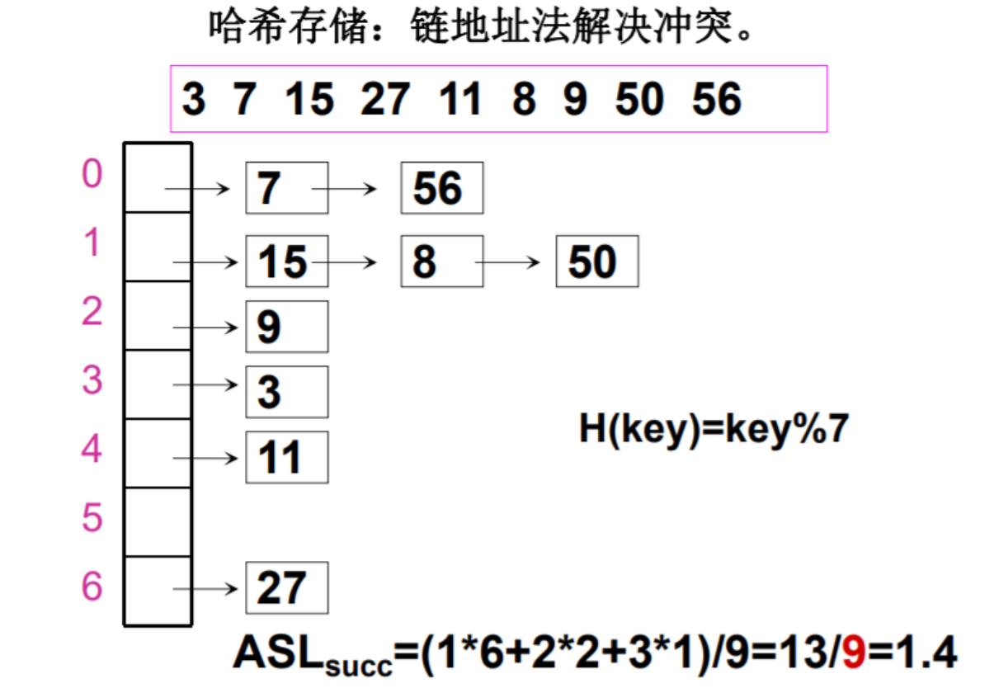
查找成功的平均查找长度 $ASL_{succ}$
查找失败的平均查找长度 $ASL_{unsucc}$
查找成功 针对的是次数，自己看上图公式
查找失败 针对的是位置，
下面举个例子：
将关键字序列{7, 8, 30, 11, 18, 9, 14}散列存储到散列表中。散列表的存储空间是一个下标从0开始的一维数组，长度为10，即{0, 1, 2, 3, 4, 5, 6, 7, 8, 9}。散列函数为： H(key) = (key * 3) % 7，处理冲突采用线性探测再散列法。
求等概率情况下查找成功和查找不成功的平均查找长度。
1 求散列表
H(7) = (7 * 3) % 7 = 0
H(8) = (8 * 3) % 7 = 3
H(30) = 6
H(11) = 5
H(18) = 5
H(9) = 6
H(14) = 0
按关键字序列顺序依次向哈希表中填入，发生冲突后按照“线性探测”探测到第一个空位置填入。
H(7) = 0，key = 7应插在第0个位置，因为第0个位置为空，可以直接插入。
H(8) = 3，key = 8应插在第3个位置，因为第3个位置为空，可以直接插入。
H(30) = 6，key = 30应插在第6个位置，因为第6个位置为空，可以直接插入。
H(11) = 5，key = 11应插在第5个位置，因为第5个位置为空，可以直接插入。
H(18) = 5，key = 18应插在第5个位置，但是第5个位置已经被key=11占据了，所以往后挪一位到第6个位置，但是第6个位置被key=30占据了，再往后挪一位到第7个位置，这个位置是空的，所以key=18就插到这个位置
H(9) = 6，key = 9应插在第6个位置，但是第6个位置已经被key = 30占据，所以需要往后挪一位到第7个位置，但是第7个位置已经被key = 18占据，所以再往后挪移到第8个位置，这个位置是空的，所以key = 9就插到这个位置。
H(14) = 0，key = 14应插在第0个位置，但第0个位置已被key=7占据，所以往后挪移一位到第1个位置，这个位置是空的，所以key=14就插到这个位置。

最终的插入结果如下表所示：
|address|0|1|2|3|4|5|6|7|8|9|
| ----- | ----- | ----- | ----- | ----- | ----- | ----- | ----- | ----- | ----- | ----- |
|key| 7 | 14 | |8 |  |11| 30|18|9 |  |

求查找不成功的平均查找长度
查找不成功，说明要查找的数字肯定不在上述的散列表中。
因为这里哈希函数的模为7，所以要查找的数的初始地址只可能位于0~6的位置上。
地址0，到第一个关键字为空的地址2需要比较3次，因此查找不成功的次数为3。比如要查找的数为28，H(28) = (28 * 3) % 7 = 0。即28对应的地址是0，由于存放在0位置的数是7，所以往后挪移一位，发现在1位置存放的数是14，继续往后挪一位，发现位置2上没有数。至此就知道28不在这个哈希表里，即查找28失败。
地址1，到第一个关键字为空的地址2需要比较2次，因此查找不成功的次数为2。
地址2，到第一个关键字为空的地址2需要比较1次，因此查找不成功的次数为1。
地址3，到第一个关键字为空的地址4需要比较2次，因此查找不成功的次数为2。
地址4，到第一个关键字为空的地址4需要比较1次，因此查找不成功的次数为1。
地址5，到第一个关键字为空的地址9需要比较5次，因此查找不成功的次数为5。
比如要查找的数为4，H(4) = (4 * 3) % 7 = 5，所以从地址5开始查找，最终发现地址5、地址6、地址7、地址8上存放的数都不是5，并且地址9的位置上没放数据，至此可知5不在这个哈希表里。
地址6，到第一个关键字为空的地址9需要比较4次，因此查找不成功的次数为4。
所以，查找不成功的平均查找长度为（3 + 2 + 1 + 2 + 1 + 5 + 4）/ 7 = 18 / 7。

看图 标准画法

## T9 构造二叉排列树
已知关键字序列 {23, 13, 5, 28, 14, 25},试构造二叉排列树
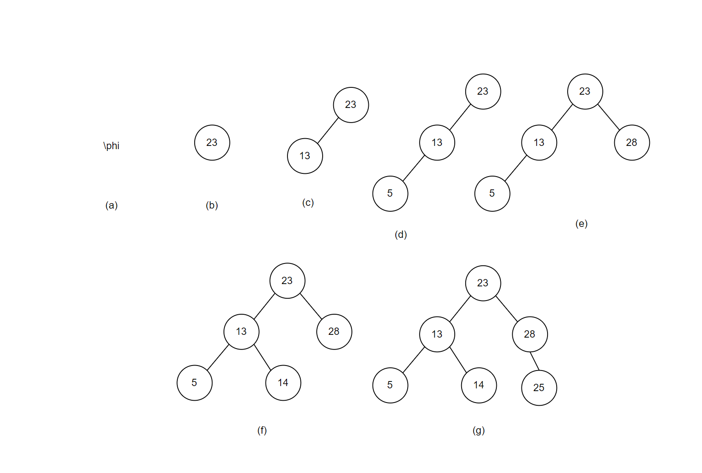

## T10 用C++编写的求二叉树深度的算法
二叉树的定义首先，我们需要定义二叉树的节点结构：
```c++
cpp#include <iostream>
using namespace std;

struct TreeNode {
    int val;
    TreeNode* left;
    TreeNode* right;
    TreeNode(int x) : val(x), left(nullptr), right(nullptr) {}
};
```
求二叉树深度的算法接下来，编写递归算法来求二叉树的深度：

```c++
cppint maxDepth(TreeNode* root) {
    // 如果当前节点为空，返回深度为0
    if (root == nullptr) {
        return 0;
    }
    // 递归求左子树的深度
    int left_depth = maxDepth(root->left);
    // 递归求右子树的深度
    int right_depth = maxDepth(root->right);
    // 当前节点的深度为左右子树深度的最大值加1
    return max(left_depth, right_depth) + 1;
}
```

示例代码以下是一个完整的示例代码，包括二叉树的构建和深度的计算：    
```c++
#include <iostream>
using namespace std;

struct TreeNode {
    int val;
    TreeNode* left;
    TreeNode* right;
    TreeNode(int x) : val(x), left(nullptr), right(nullptr) {}
};

int maxDepth(TreeNode* root) {
    if (root == nullptr) {
        return 0;
    }
    int left_depth = maxDepth(root->left);
    int right_depth = maxDepth(root->right);
    return max(left_depth, right_depth) + 1;
}

int main() {
    // 构建一个二叉树
    //       1
    //      / \
    //     2   3
    //    / \
    //   4   5
    TreeNode* root = new TreeNode(1);
    root->left = new TreeNode(2);
    root->right = new TreeNode(3);
    root->left->left = new TreeNode(4);
    root->left->right = new TreeNode(5);

    // 计算二叉树的深度
    int depth = maxDepth(root);
    cout << "二叉树的深度是： " << depth << endl;

    // 释放内存
    delete root->left->left;
    delete root->left->right;
    delete root->left;
    delete root->right;
    delete root;

    return 0;
}
```

输出结果运行上述代码，输出结果为：二叉树的深度是： 3

# 模拟四
## T1.1 数据结构 线性结构


1. 线性结构
   1. 线性结构是什么？
    数据结构中线性结构指的是数据元素之间存在着“一对一”的线性关系的数据结构。线性结构是一个有序数据元素的集合。
   2. 线性结构特点：
    线性结构有唯一的首元素（第一个元素）
    线性结构有唯一的尾元素（最后一个元素）
    除首元素外，所有的元素都有唯一的“前驱”
    除尾元素外，所有的元素都有唯一的“后继”
    数据元素之间存在“一对一”的关系，即除了第一个和最后一个数据元素之外，其它数据元素都是首尾相接的。
    如数组（a1,a2,a3,…,an）,a1为第一个元素，an为最后一个元素，此集合即为一个线性结构的集合。
    常用的线性结构有 线性表，栈，队列，双队列，循环队列，一维数组，串。
    线性表中包括顺序表、链表等，其中，栈和队列只是属于逻辑上的概念，实际中不存在，仅仅是一种思想，一种理念；线性表则是在内存中数据的一种组织、存储的方式。
1. 非线性结构
线性结构是什么？
非线性结构中各个数据元素不再保持在一个线性序列中，数据元素之间是一对多，或者是多对一的关系。根据关系的不同，可分为层次结构（树）和群结构（图）。
常见的非线性结构有二维数组，多维数组，广义表，树(二叉树等)，图。（其中多维数组是由多个一维数组组成的， 可用矩阵来表示，他们都是两个或多个下标值对应一个元素，是多对一的关系，因此是非线性结构。）
相对应于线性结构，非线性结构的逻辑特征是一个结点元素可能对应多个直接前驱和多个后继。

## T1.4 出栈的不同顺序
给定n个不相同的字母和一个栈 问出栈的可能性有多少种？
卡特兰数：
$C_0 = 1$
$C_{n+1} = C_0C_n + C_1C_{n-1} + \cdots + C_nC_0$

## T1.5 哈夫曼树（最优树）
给定N个权值作为N个叶子结点，构造一棵二叉树，若该树的带权路径长度达到最小，称这样的二叉树为最优二叉树，也称为哈夫曼树(Huffman Tree)。哈夫曼树是带权路径长度最短的树，权值较大的结点离根较近。

**若将树中结点赋给一个有着某种含义的数值，则这个数值称为该结点的权。结点的带权路径长度为：从根结点到该结点之间的路径长度与该结点的权的乘积。**
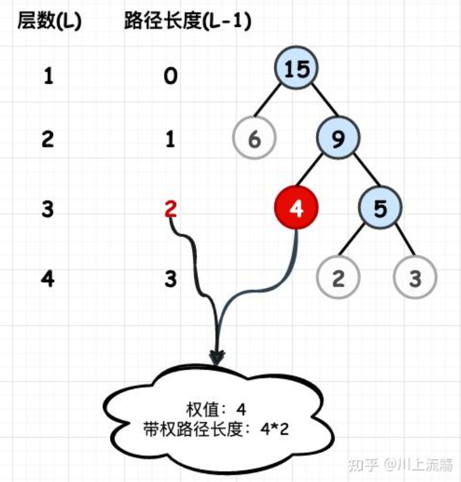
哈夫曼树的构造：
树的带权路径长度规定为所有叶子结点的带权路径长度之和，记为WPL。
如上图：数的带权路径长度为：
WPL = (2+3) * 3 + 4 * 2 + 6 * 1 = 29
假设有n个权值，则构造出的哈夫曼树有n个叶子结点。 n个权值分别设为 w1、w2、…、wn，则哈夫曼树的构造规则为：
(1) 将w1、w2、…，wn看成是有n 棵树的森林(每棵树仅有一个结点)；
(2) 在森林中选出两个根结点的权值最小的树合并，作为一棵新树的左、右子树，且新树的根结点权值为其左、右子树根结点权值之和；
(3)从森林中删除选取的两棵树，并将新树加入森林；
(4)重复(2)、(3)步，直到森林中只剩一棵树为止，该树即为所求得的哈夫曼树。
例如：对 2，3，4，6 这四个数进行构
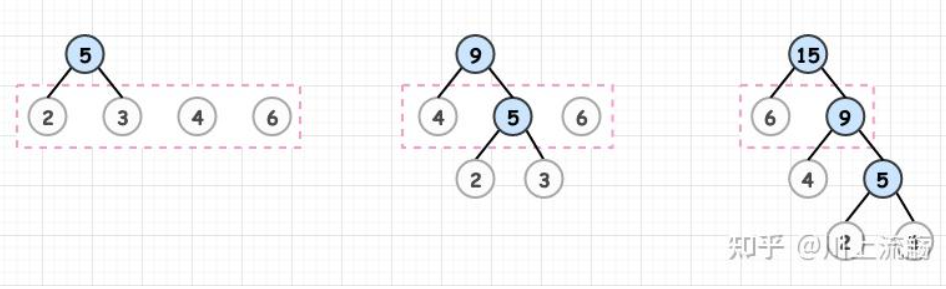
<mark>求带权路径长度 $s = 1 * 6 + 2 * 4 + 3 * 2 + 3 * 3 $</mark>

## T1.6-8 二叉树的遍历
四种主要的遍历思想为：
前序遍历：根结点 ---> 左子树 ---> 右子树
中序遍历：左子树---> 根结点 ---> 右子树
后序遍历：左子树 ---> 右子树 ---> 根结点
层次遍历：只需按层次遍历即可
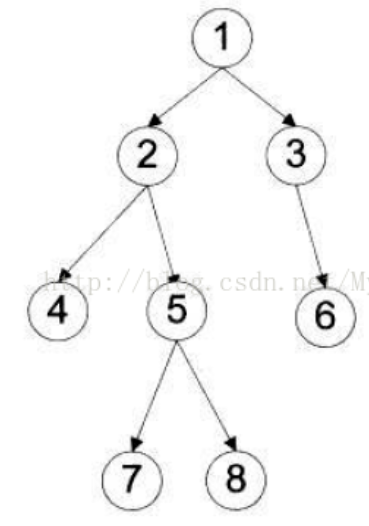
前序遍历：1  2  4  5  7  8  3  6 
中序遍历：4  2  7  5  8  1  3  6
后序遍历：4  7  8  5  2  6  3  1
层次遍历：1  2  3  4  5  6  7  8

若 中序遍历的序列为 A, B, C, D, E, F, G 后序遍历的序列为 B, D, C, A, F, G, E
构造二叉树
重点 ： <mark>每个节点是左是右是自由的: 即对于中序遍历，没有左节点会直接进入上一节的根节点；后序遍历可以很快确定树的层次</mark>
如下 有三个叶子结点
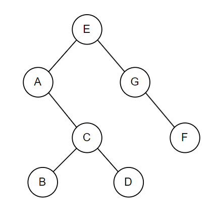

## T1.9 完全二叉树的定义
**若设二叉树的高度为h，除第 h 层外，其它各层 (1～h-1) 的结点数都达到最大个数(即1~h-1层为一个满二叉树)，第 h 层所有的结点都连续集中在最左边，这就是完全二叉树。**

## T1.10 堆排序，大根堆，小根堆
堆 是一种特殊的 完全二叉树，具有堆化的特性。
大根堆: 父结点的值 大于或等于 其子结点的值
小根堆: 父结点的值 小于或等于 其子结点的值
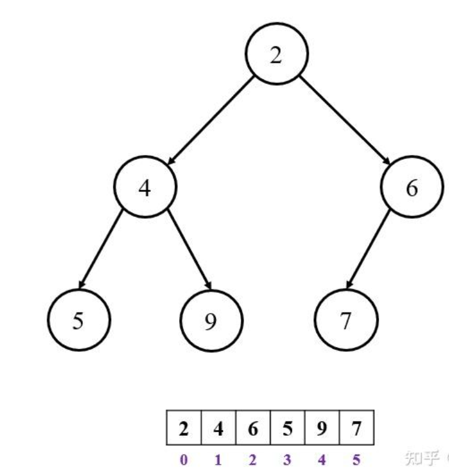
其存储结构类似于完全二叉树，可以用数组实现。
设 关键字 q, m, z, a, g 建立小根堆
```
    a
   / \
  g   z
 / \
m   q
```

## T2 数据结构线性表的查找——顺序查找、折半查找、分块查找
顺序查找：
1. 方法:从线性表的一端开始，依次将记录的关键字与给定值进行比较，也就是逐个检查关键字是否满足给定的条件。
若查找到某个记录的关键字和给定值相等，则查找成功；反之，查找失败。
2. 要求 ：无特殊要求
3. 对于有n个元素的表，给定值key与表中第i个元素相等，
   查找成功的平均查找长度 $ASL_\{succ\} = \sum_{i = 1}^{n}P_i(n - i + 1) = (n + 1) / 2 $
查找失败的查找长度 $ASL_\{unsucc\} = n + 1 $

折半查找：
1. 方法:从表中间记录开始，如果给定值key和中间记录的关键字相等，则查找成功；如果给定值key比中间记录的关键字大或小，则在表中大或小的中间记录的那一半中继续查找，重复这样的操作，直至查找成功，或确定表中没有所需要查找的元素，则查找失败，返回失败信息。
2. 要求：表中的元素必须以关键字的大小递增或递减的次序存放
3. 对于有n个元素的表，给定值key与表中第i个元素相等，
   查找成功的平均查找长度 $ASL_\{succ\} =  log_2(n+1)+1$

分块查找：
1. 方法：分块查找与前两种方法相比，需额外建立一个“索引表”。
将查找表分为若干子表（或称块），对每个子表建立一个索引项，其中包含两项内容：关键字项（其值为该子表内的最大）和指针项（指示该子表的第一个记录在表中的位置）。每个索引项构成一个索引表，索引表按关键字有序排列。
2. 要求：块内的元素可以无序，但块间的元素是有序的，即第一块中最大关键字小于第二块中的所有记录的关键字，第二块中最大关键字小于第三块中的所有记录的关键字，以此类推。
3. 查找成功的平均查找长度：
若用顺序查找 $ASL_\{succ\} =  (n / s + s ) / 2 + 1$
若用折半查找 $ASL_\{succ\} =  log_2(n /s + 1 )+ s / 2$

## T5 邻接矩阵 最小生成树 深度优先广度优先 （前两个上面有）
深度优先 可等价于 前序遍历
广度优先 可等价于 层次遍历

## T7 哈希表冲突处理方法
1. 开放寻址法
原理是当发生hash冲突时，会以当前地址为基准，然后根据寻址方法（探查寻址），去寻找下一次地址。若依旧发生冲突，则继续寻址，直到找到一个空的位置为止。 通用的散列函数形式为：
Hi=（H（key）+di）% m （i=1，2，…，n）
其中H（key）为哈希函数，m 为表长，di称为增量序列。增量序列的取值方式不同，相应的再散列方式也不同。
   1. 线性探查（线性探测再散列）
    顺序查找表的下一个单元，直到找到一个空单元或查遍全表。
    即当hash值为3冲突时(假设此时hash表长度为11)，利用线性探查的过程为：
    H1 = (3+1)%11 = 4，此时若4依旧冲突，则再hash，即
    H2 = (3+2)%11 = 5 … 通过这种线性增长增量系列，直到找到空的位置为止。
    2. 二次探查
    这种方法的特点是，当哈希冲突时，在表的左右进行跳跃探测，比较灵活。
    此时di = 1^2, -1^2, 2^2, -2^2 …
    假设当hash值为3冲突时(假设此时hash表长度为11)，利用二次探查的过程为：
    H1 = (3+1^2)%11 = 4,此时若4依旧冲突，则再hash,即
    H2 = (3+(-1)^2)%11 = 2 …
    通过该方法直到找到空位置为止。
    3. 伪随机探测
    这种方法即是产生一些随机系列值，并给定随机数作为起点。
    假设当hash值为3冲突时(假设此时hash表长度为11)，利用伪随机探测的过程为：
    假设产生的随机系列为2，5，9 …，则
    H1 = (3+2)%11 = 5
    H2 = (3+5)%11 = 8
    通过该方法直到找到空位置为止。

2.  链地址法（拉链法）
HashMap，HashSet其实都是采用的拉链法来解决哈希冲突的，就是在每个位桶实现的时候，我们采用链表（jdk1.8之后采用链表+红黑树）的数据结构来去存取发生哈希冲突的输入域的关键字（也就是被哈希函数映射到同一个位桶上的关键字）。首先来看使用拉链法解决哈希冲突的几个操作：
    1. 插入操作：在发生哈希冲突的时候，我们输入域的关键字去映射到位桶（实际上是实现位桶的这个数据结构，链表或者红黑树）中去的时候，我们先检查带插入元素x是否出现在表中，很明显，这个查找所用的次数不会超过装载因子（n/m : n为输入域的关键字个数，m为位桶的数目），它是个常数，所以插入操作的最坏时间复杂度为O(1)的。
    2. 查询操作：和插入操作一样，在发生哈希冲突的时候，我们去检索的时间复杂度不会超过装载因子，也就是检索数据的时间复杂度也是O(1)的
    3. 删除操作：如果在拉链法中我们想要使用链表这种数据结构来实现位桶，在删除一个元素x的时候，需要更改x的前驱元素的next指针的属性，把x从链表中删除。这个操作的时间复杂度也是O(1)的。

3. 再哈希法
fi=(f(key)+i*g(key)) % m (i=1，2，……，m-1)
其中，f(key) 和 g(key) 是两个不同的哈希函数，m为哈希表的长度
步骤：
双哈希函数探测法，先用第一个函数 f(key) 对关键码计算哈希地址，一旦产生地址冲突，再用第二个函数 g(key) 确定移动的步长因子，最后通过步长因子序列由探测函数寻找空的哈希地址。
比如，f(key)=a 时产生地址冲突，就计算g(key)=b，则探测的地址序列为 f1=(a+b) mod m，f2=(a+2b) mod m，……，fm-1=(a+(m-1)b) % m。

4. 公共溢出区法
即设立两个表：基础表和溢出表。将所有关键字通过哈希函数计算出相应的地址。然后将未发生冲突的关键字放入相应的基础表中，一旦发生冲突，就将其依次放入溢出表中即可。
在查找时，先用给定值通过哈希函数计算出相应的散列地址后，首先与基本表的相应位置进行比较，如果不相等，再到溢出表中**顺序查找**。

eg 
给定数据序列 {100, 20, 21, 35, 3, 78, 99, 45} 哈希表地址空间为 0...8 哈希函数为 $H(key) = key \% 7$
**注意哈希地址 0到模数加一**
|哈希地址|0|1|2|3|4|5|6|7|8|
|----|----|----|----|----|----|----|----|----|----|
|关键字|21|35|100|3|78|99|20|45||
|比较次数|1|2|1|1|4|5|1|5||

$ASL_\{succ\} = (4 * 1 + 1 * 2 + 1 * 4 + 2 * 5) / 8 = 2.5$

## T9 画二叉树
还是注意每一个结点的左右属性可以自己定，题卡了就想一下这个
给定先序和中序， 先根据结点个数确定层数和叶子数，再根据中序进行分层。

## T10 试写一递归算法，从大到小输出二叉排序树中所有的关键字值小于key的元素值。
``` c++
#include <iostream>
using namespace std;

// 定义二叉树节点结构
struct TreeNode {
    int val;
    TreeNode* left;
    TreeNode* right;
    TreeNode(int x) : val(x), left(nullptr), right(nullptr) {}
};

// 递归函数：从大到小输出小于 key 的所有元素
void printSmallerKeys(TreeNode* root, int key) {
    // 如果当前节点为空，直接返回
    if (root == nullptr) {
        return;
    }

    // 先递归处理右子树（因为右子树的值更大）
    printSmallerKeys(root->right, key);

    // 如果当前节点的值小于 key，则输出
    if (root->val < key) {
        cout << root->val << " ";
    }

    // 再递归处理左子树（因为左子树的值更小）
    printSmallerKeys(root->left, key);
}

// 主函数
int main() {
    // 创建一个示例二叉排序树
    TreeNode* root = new TreeNode(50);
    root->left = new TreeNode(30);
    root->right = new TreeNode(70);
    root->left->left = new TreeNode(20);
    root->left->right = new TreeNode(40);
    root->right->left = new TreeNode(60);
    root->right->right = new TreeNode(80);

    // 定义 key 值
    int key = 65;

    // 输出小于 key 的所有元素
    cout << "Elements smaller than " << key << " (in descending order): ";
    printSmallerKeys(root, key);
    cout << endl;

    // 释放二叉树内存（可选）
    // 这里可以实现一个递归删除函数来释放内存
    return 0;
}
```
代码说明
1. 二叉树节点定义:
·使用TreeNode结构体定义二叉树节点，包含值val和左右子节点指针。
2. 递归函数printSmallerKeys:
·从右子树开始递归，确保先访问较大的值。
·如果当前节点的值小于key，则输出该值。
·然后递归处理左子树。
3. 主函数：
·创建一个示例二叉排序树。
·定义一个key值。
·调用printSmallerKeys函数输出所有小于key的元素。

# 模拟五
## T1.3 排序的小结论
在二叉树的结点的先序序列，中序序列和后序序列中， 所有**叶子节点**的先后顺序都相同。

## T1.6 树 二叉树 森林之间的转换
专业一点的定义是：若干棵互不相交的树的集合。
树由唯一的根和若干棵互不相交的子树组成。
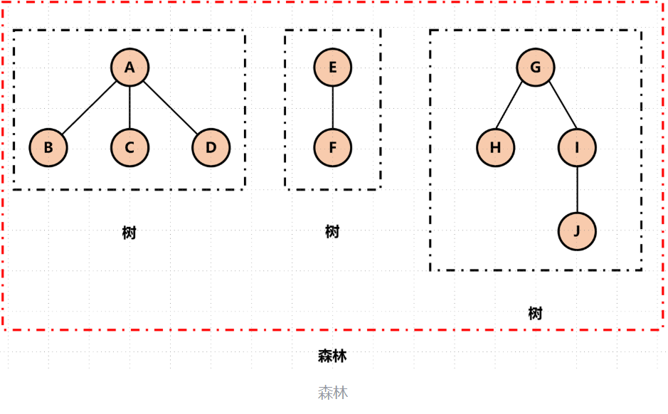


<mark>设森林F对应的二叉树为B，它有m个结点，B的根为p，p的右子树上的结点个数为n，森林F中第一棵树的结点个数是 **m - n**
森林F对应的二叉树为B 指 将森林F转为二叉树B 余下操作都在二叉树B中进行</mark>

!!! ! 根结点也是结点捏

<figure>
    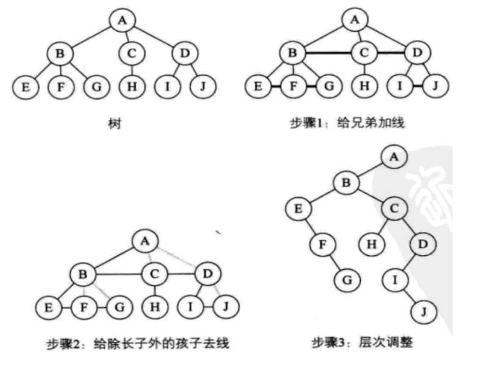
    <figcaption>图 1: 树转二叉树的示意图</figcaption>
    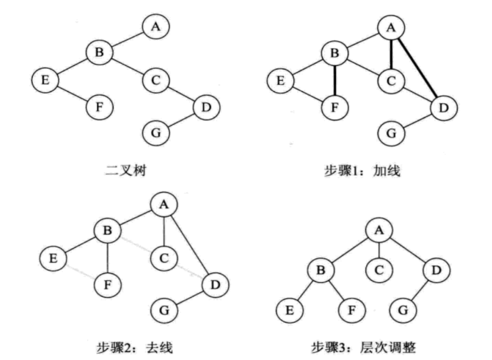
    <figcaption>图 1: 二叉树转树的示意图</figcaption>
    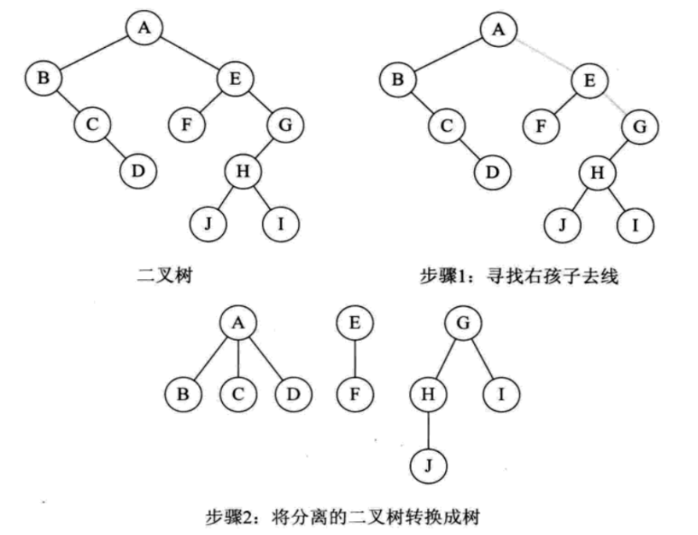
    <figcaption>图 1: 二叉树转森林的示意图</figcaption>
    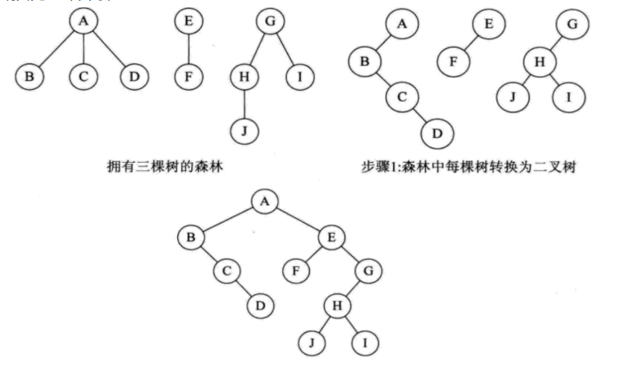
    <figcaption>图 1: 森林转二叉树的示意图</figcaption>
</figure>

## T1.7 强连通
强连通
在一幅无向图中，如果有一条路径连接顶点v和w，则它们就是连通的；然后，在一幅有向图中，如果从顶点v有一条有向路径达到w，则顶点w是从顶点v可达的，但如果从w到达v的路径可能不存在。这两个顶点不是强连通的。

>强连通（Strongly Connected）是指一个有向图（Directed Graph）中任意两点v1、v2间存在v1到v2的路径（path）及v2到v1的路径。

>如果两个顶点互相可达，则它们是强连通的。如果一幅有向图中任意两个顶点都是强连通的，则这幅有向图也是强连通的。

强连通分量
有向图中的强连通性是一种顶点之间平等关系，有着以下性质：

>自反性： 任意顶点和自己都是强连通的
对称性：如果v和w是强连通的，那么w和v也是强连通的
传递性：如果v和w是强连通的且如果w和x也是强连通的，那么v和x也是强连通的
强连通性将所有顶点分成了一些平等的部分，每个部分都是由相互均为强连通的顶点的最大子集组成的。这些子集称为强连通分量(强连通分支)

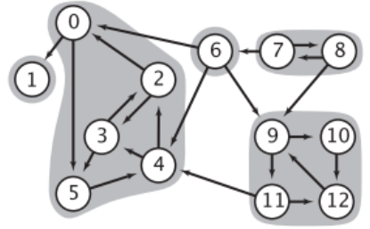
如上图可以分为5个强连通分量。 一个含有V个顶点的有向图可能有1~V个强连通分量；一个强连通图只含一个强连通分量；而一个有向无环图中含有V个强连通分量。

!!! ! 对于具有n个顶点的强连有向图，其弧条数的最小值为 n （有向环图）

## T2 前中后缀表达式
1. 中缀表达式：
    操作符以中缀形式位于运算数中间（如：3+2），是我们日常通用的算术和逻辑公式表示方法。
2. 后缀表达式：
    又称逆波兰式（，**操作符以后缀形式位于两个运算数后**（如：3+2的后缀表达形式就是3 2 +）。
3. 前缀表达式：
    又称波兰式，操作符以前缀形式位于两个运算数前（如：3+2的前缀表达形式就是+ 3 2）。
>中缀表达式往往需要使用括号将操作符和对应的操作数括起来，用于指示运算的次序
中缀表达式适合于人类的思维结构和运算习惯，但并不适用于计算机适用于计算机的后缀表达式
与中缀表达式不同，后缀表达式不需要使用括号来标识操作符的优先级。
后缀表达式的计算按 操作符 从左到右出现的顺序依次执行(不考虑运算符之间的优先级)，对于计算机而言是比较简单的结构。
eg:
中缀转后缀
中缀表达式：2*(3+5)+7/1-4
后缀表达式：2 3 5 + * 7 1 / + 4 -

!!! ! 算法实现：从左至右依次遍历中缀表达式各个字符（需要准备一个字符栈存储操作符和括号）x   
>   1. 字符为 运算数 ：
    直接送入后缀表达式（注：需要先分析出完整的运算数）。
    1. 字符为 左括号 ：
    直接入栈（注：左括号入栈后优先级降至最低）。
    2. 字符为 右括号 ：
    直接出栈，并将出栈字符依次送入后缀表达式，直到栈顶字符为左括号（左括号也要出栈，但不送入后缀表达式）。
    总结：只要满足 栈顶为左括号 即可进行最后一次出栈。
    3. 字符为 操作符 ：
    若栈空，直接入栈。
    **若栈非空**，判断栈顶操作符，若栈顶操作符优先级低于该操作符，该操作符入栈；否则一直出栈，并将出栈字符依次送入后缀表达式，直到栈空或栈顶操作符优先级低于该操作符，该操作符再入栈。
    总结：只要满足 栈空 或者 优先级高于栈顶操作符 即可停止出栈，并将该操作符入栈。
    4. 重复以上步骤直至遍历完成中缀表达式，接着判断字符栈是否为空，非空则直接出栈，并将出栈字符依次送入后缀表达式。
    注：中缀表达式遍历完成，栈中可能还有字符未输出，故需要判断栈空。

## T3 顺序存储表和二叉链表存储示意图
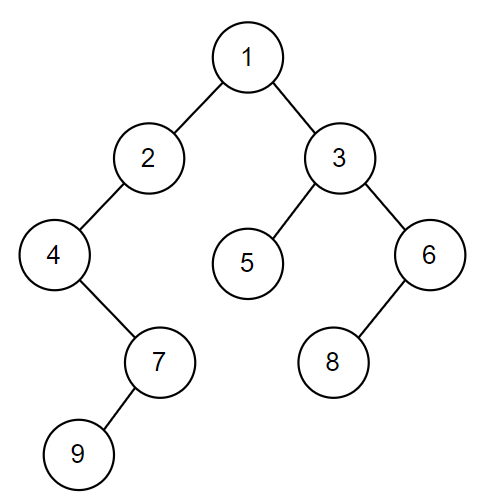

1. **画出 顺序存储表示:**

    |0|1|2|3|4|5|6|7|8|9|10|11|12|13|14|15|16|17|18|
    | ---- | ---- | ---- | ---- | ---- | ---- | ---- | ---- | ---- | ---- | ---- | ---- | ---- | ---- | ---- | ---- | ---- | ---- | ---- |
    ||1|2|3|4||5|6||7|||||8||||9|

    <mark>把这个表当作满二叉树来填 没有的就不填 注意左右节点的顺序</mark>

2. **二叉树的二叉链表存储表示的示意图如下图所示：**
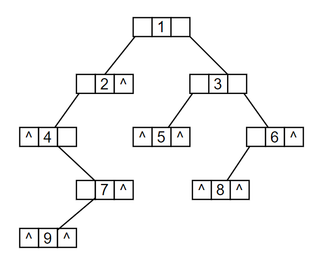
<figcaption>注意线要画到格子里面</figcaption>

## T4 判断序列是不是小根堆
判断以下序列是否是小根堆？如果不是，将它调整为小根堆。
(1)(12,70,33,65,24,56,48,92,86,33)
(2)(05,23，20，28，40,38,29，61,35，76,47,100)

!!! ! 先把序列转换成完全二叉树！！！ 判断和调整顺序亦是如此 注意答案不唯一

## T5 最小生成树 格式问题
写出最小生成树依次得到的边：
(1，2)3，(1，3)5， (1，4)8，(4，6)4，(2，5)10， (4，7)20
注意两种算法的次序可能会有差别 prime更注重每个结点的最小值 另外一个注意的是全局最小值

## T7
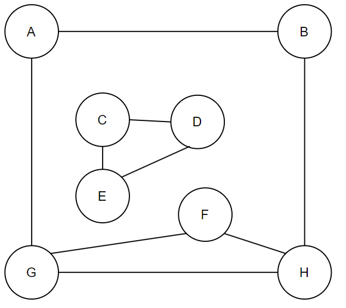

（1）图G有几个连通分量？
（2）按深度优先搜索所得的树是什么？
（3）按深度优先搜索所得的顶点序列是什么？

(1) 两个
(2) 如下图 注意左右结点
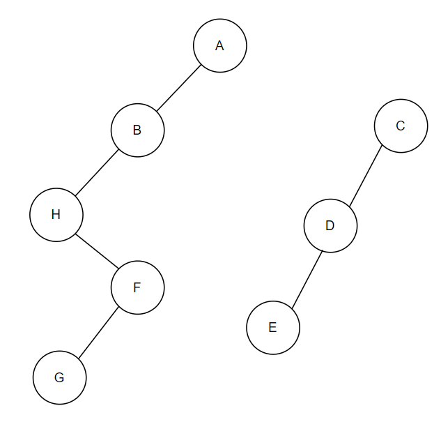
(3) ABHFGCDE

## T8 小细节
已知一树边为：
{<I，M>，<I，N>，<E，I>，<B，E>，<B，D>，<C，B>，<G，L>，<G，K>，<A，G>，<A，F>，<A，H>，<C，A>}
尖括号左边是父节点 右边是子节点

## T9
给定关键字序列 \(T=(12,2,16,30,8,28,4,10,20,6,18)\)，我们需要使用以下两种排序算法进行排序，并记录每一趟结束时的序列。
（1）希尔排序（第一趟排序的<mark>**增量为 5**</mark>）
希尔排序是一种基于插入排序的算法，它通过比较距离一定间隔的元素来工作，然后逐步减小间隔来排序元素。
对于增量为 5 的希尔排序，我们首先将数组分为 5 个小组，每个小组的元素之间相隔 5 个位置，然后对每个小组进行插入排序。
初始序列:\(T=(12,2,16,30,8,28,4,10,20,6,18)\)
>第一趟排序（增量为 5）:
• 第一组：\(12,8\)
• 第二组：\(2,28,6\)
• 第三组：\(16,4,20\)
• 第四组：\(30,10\)
• 第五组：\(18\)

>排序后：
• 第一组：\(8,12\)
• 第二组：\(2,6,28\)
• 第三组：\(4,16,20\)
• 第四组：\(10,30\)
• 第五组：\(18\)

合并后序列：\((8,2,4,10,8,6,16,12,20,30,18)\)
（2）快速排序（<mark>**选第一个记录为枢纽**</mark>）
快速排序是一种分治算法，它通过选择一个枢纽元素，将数组分为两部分，一部分的所有元素都比枢纽小，另一部分的所有元素都比枢纽大，然后递归地对这两部分进行快速排序。
初始序列:\(T=(12,2,16,30,8,28,4,10,20,6,18)\)
>第一趟排序（以第一个元素 12 为枢纽）:
• 小于 12 的元素：\(2,8,4,6,10\)
• 等于 12 的元素：\(12\)
• 大于 12 的元素：\(16,30,28,20,18\)

排序后序列：\((2,8,4,6,10,12,16,30,28,20,18)\)

## T10 编写复制一颗二叉树的非递归算法
``` c++
#include <iostream>
#include <unordered_map>
#include <stack>

// 定义二叉树节点结构
struct TreeNode {
    int val;
    TreeNode *left;
    TreeNode *right;
    TreeNode(int x) : val(x), left(nullptr), right(nullptr) {}
};

// 复制二叉树的函数
TreeNode* copyTree(TreeNode* root) {
    if (!root) return nullptr;
    
    std::unordered_map<TreeNode*, TreeNode*> oldToNew;
    std::stack<TreeNode*> stack;
    stack.push(root);
    
    while (!stack.empty()) {
        TreeNode* oldNode = stack.top();
        stack.pop();
        
        // 创建新节点
        TreeNode* newNode = new TreeNode(oldNode->val);
        oldToNew[oldNode] = newNode;
        
        // 先右后左，保证左子树在栈顶
        if (oldNode->right) stack.push(oldNode->right);
        if (oldNode->left) stack.push(oldNode->left);
    }
    
    // 建立新树的左右子树链接
    for (auto& pair : oldToNew) {
        TreeNode* oldNode = pair.first;
        TreeNode* newNode = pair.second;
        
        if (oldNode->left) newNode->left = oldToNew[oldNode->left];
        if (oldNode->right) newNode->right = oldToNew[oldNode->right];
    }
    
    return oldToNew[root];
}

// 辅助函数：前序遍历打印二叉树
void printTree(TreeNode* node) {
    if (node == nullptr) return;
    std::cout << node->val << " ";
    printTree(node->left);
    printTree(node->right);
}

// 主函数
int main() {
    // 构建原始二叉树
    //     1
    //    / \
    //   2   3
    //  / \
    // 4   5
    TreeNode* root = new TreeNode(1);
    root->left = new TreeNode(2);
    root->right = new TreeNode(3);
    root->left->left = new TreeNode(4);
    root->left->right = new TreeNode(5);

    // 复制二叉树
    TreeNode* copiedRoot = copyTree(root);

    // 打印复制后的二叉树
    std::cout << "Copied Binary Tree (Preorder Traversal): ";
    printTree(copiedRoot);
    std::cout << std::endl;

    // 释放内存（这里省略了详细的内存释放代码，实际应用中需要小心处理）
    delete copiedRoot;
    delete root;

    return 0;
}
```
这个程序首先定义了一个二叉树节点结构`TreeNode`，然后实现了`copyTree`函数来复制二叉树。复制过程分为两个阶段：首先使用栈来创建新节点并记录旧节点到新节点的映射，然后根据这个映射建立新树的左右子树链接。最后，`main`函数中构建了一个示例二叉树，复制了它，并打印了复制后的二叉树的前序遍历结果。

# 最后一份
## T1.2
给定 $F(n)= log n^2 , g(n) = log (n+5)$ 比较两个函数的三个复杂度记号
1. \(f(n)=O(g(n))\)-大 O 记号
大 O 记号用来描述函数\(f(n)\)的上界。它表示存在正的常数\(c\)和\(n_0\)，使得对于所有\(n\geq n_0\)，都有\(f(n)\leq c\cdot g(n)\)。换句话说，\(f(n)\)的增长速率不会超过\(g(n)\)的常数倍。大 O 记号常用于说明一个算法的最坏情况性能。
例如，如果\(f(n)=3n^2+2n+1\)，那么\(f(n)=O(n^2)\)，因为\(f(n)\)的增长速率不会超过\(n^2\)的常数倍。
2. \(f(n)=\Omega(g(n))\)-大 Omega 记号
大 Omega 记号用来描述函数\(f(n)\)的下界。它表示存在正的常数\(c\)和\(n_0\)，使得对于所有\(n\geq n_0\)，都有\(f(n)\geq c\cdot g(n)\)。换句话说，\(f(n)\)的增长速率不会低于\(g(n)\)的常数倍。大 Omega 记号常用于说明一个算法的最好情况性能。
例如，如果\(f(n)=3n^2+2n+1\)，那么\(f(n)=\Omega(n^2)\)，因为\(f(n)\)的增长速率不会低于\(n^2\)的常数倍。
3. \(f(n)=\Theta(g(n))\)-Theta 记号
Theta 记号用来描述函数\(f(n)\)的紧确界。它表示\(f(n)\)既被\(g(n)\)的常数倍所上界，也被\(g(n)\)的常数倍所下界。换句话说，存在正的常数\(c_1\)、\(c_2\)和\(n_0\)，使得对于所有\(n\geq n_0\)，都有\(c_1\cdot g(n)\leq f(n)\leq c_2\cdot g(n)\)。Theta 记号说明\(f(n)\)和\(g(n)\)具有相同的增长速率。
例如，如果\(f(n)=3n^2+2n+1\)，那么\(f(n)=\Theta(n^2)\)，因为\(f(n)\)的增长速率与\(n^2\)相同。

>对于给定的函数\(F(n)=2\log n\)和\(g(n)=\log(n+5)\)，我们需要确定它们之间的关系是否符合大 O 记号（\(O\)）、大 Omega 记号（\(\Omega\)）和 Theta 记号（\(\Theta\)）。
• 大 O 记号（\(O\)）表示\(f(n)\)的增长速率不会超过\(g(n)\)的某个常数倍。对于\(F(n)=2\log n\)和\(g(n)=\log(n+5)\)，我们可以看到\(F(n)\)的增长速率是\(g(n)\)的两倍，因此\(F(n)=O(g(n))\)是正确的。
• 大 Omega 记号（\(\Omega\)）表示\(f(n)\)的增长速率不会低于\(g(n)\)的某个常数倍。由于\(F(n)\)的增长速率是\(g(n)\)的两倍，这意味着\(F(n)\)的增长速率不会低于\(g(n)\)，因此\(F(n)=\Omega(g(n))\)也是正确的。
• Theta 记号（\(\Theta\)）表示\(f(n)\)的增长速率与\(g(n)\)相同，即\(f(n)\)既被\(g(n)\)的常数倍所上界，也被\(g(n)\)的常数倍所下界。由于\(F(n)\)的增长速率是\(g(n)\)的两倍，它们并不具有相同的增长速率，因此\(F(n)=\Theta(g(n))\)是错误的。
• A.\(f(n)=O(g(n))\)是正确的。
• B.\(f(n)=\Omega(g(n))\)是正确的。
• C.\(f(n)=\Theta(g(n))\)是错误的。
因此，选项 A 和 B 是正确的，选项 C 是错误的。

## T1.3 
用贪心算法解决背包问题时的贪心策略是（C）。 
A. 重量小的物品优先装入背包。 
B. 价值大的物品优先装入背包。 
C. 单位重量的价值大的物品优先装入背包。 
D. 单位重量的价值小的物品优先装入背包。

## T1.4
回溯法求解 n 个顶点的图的最大团问题时，算法的复杂度是（ ）。 
A. O(nmⁿ) B. O(n²) C. O(n2ⁿ) D. O(2ⁿ)
>最大团问题（Maximum Clique Problem）是一个著名的NP完全问题，它要求在一个给定的图中找到一个最大的完全子图（团）。使用回溯法来解决最大团问题时，算法的复杂度主要取决于图中顶点的数量\(n\)和边的数量\(m\)。

对于每个顶点，我们都需要决定是否将其包含在当前的团中，这导致算法的复杂度至少是指数级的。在最坏的情况下，我们需要检查所有可能的顶点组合，以确定它们是否形成一个团。
>算法的复杂度可以这样分析：
• 顶点选择：对于每个顶点，我们有两个选择：要么将其包含在团中，要么不包含。因此，对于\(n\)个顶点，总共有\(2^n\)种可能的选择组合。
• 团验证：对于每种选择组合，我们都需要验证这些顶点是否形成一个团。这需要检查所有顶点对之间是否存在边，其复杂度与顶点对的数量有关，即\(O(n^2)\)。

因此，算法的总体复杂度是\(O(n^2\cdot 2^n)\)，这与选项 D\(O(2^n)\)相似，但更精确的表达应该是\(O(n^2\cdot 2^n)\)，这表明算法的复杂度不仅取决于\(2^n\)，还与\(n^2\)成正比。
然而，如果我们只考虑顶点的选择而不具体考虑边的数量，那么复杂度可以简化为\(O(2^n)\)，这与选项 D 相符。
所以，正确答案是D.\(O(2^n)\)，这是在不考虑边的数量\(m\)时的简化复杂度。如果考虑边的数量，更精确的复杂度应该是\(O(n^2\cdot 2^n)\)，但这不在给定的选项中。

## T2 填空


1.  算法是由若干条指令组成的有穷序列，且满足输入、输出、<mark>确定性</mark>、<mark>有穷性</mark>和能行性共 5 条性质。

2. 用二分搜索算法在一个有序序列a[1:n]中查找某指定元素x是否存在。在查找的过程中，假定当前查找的范围是a[low:high]，其中1≤low<high≤n。分治策略中的分解操作是<mark>计算中间位置 mid=⌊(low+high)/2⌋，将查找范围缩小为 a[low:mid]或 a[mid+1:high]</mark>。

3. 用A[1:n]表示A1⋯An连乘，用动态规划求解A[1:n]时，计算各子问题最优值的复杂度是<mark>O(n³)</mark>。

4. 回溯法算法框架中定义问题的解空间时，解的形式是<mark>n-元组</mark>；解空间结构的组织形式通常有①<mark>子集树</mark>，②<mark>排列树</mark>，③<mark>混合树</mark>。

5. 分支限界法中，从活结点表中选择下一个扩展结点的不同方式导致了不同的分支限界法，最常见的有<mark>队列式分支限界法</mark>和<mark>优先队列式分支限界法</mark>。

6. 一般情况下，可将随机化算法大致分成 4 类，分别是<mark>数值随机化算法</mark>、<mark>拉斯维加斯算法</mark>、<mark>舍伍德算法</mark>和蒙特卡罗算法。

## T3 简答题
### 1. 简述拉斯维加斯算法的特点并举例说明。
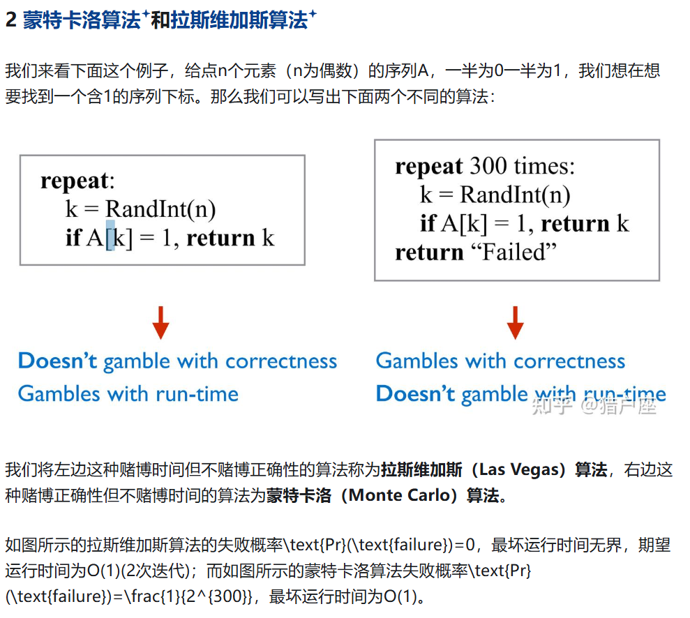

> 特点：通过随机选择推进计算，可能找不到解，但找到的解一定正确。
• 总是正确：拉斯维加斯算法要么给出一个保证正确的答案，要么报告失败，它不会给出错误的答案。
• 运行时间可变：算法的运行时间不是固定的，它可能在不同的运行中有不同的运行时间。有些情况下，算法可能快速完成，而在其他情况下可能需要更长的时间。
• 概率界限：拉斯维加斯算法通常能够在期望运行时间内解决问题，或者在最坏情况下给出一个运行时间的界限。
• 可重复性：如果算法报告失败，你可以重新运行它，每次都有机会在期望时间内解决问题。

举例说明
八皇后问题中随机放置皇后，满足条件即得解。
例子：整数乘法
考虑一个简单的问题，即计算两个大整数的乘积。一个拉斯维加斯算法可能会采用以下策略：
• 快速乘法：首先尝试使用快速傅里叶变换（FFT）算法来计算乘积。FFT算法在最好的情况下可以提供非常快的运行时间，例如\(O(n\log n)\)。
• 随机化调整：如果在快速乘法中使用了随机化，算法可能会在某些情况下失败（即不能给出结果）。例如，如果随机化导致快速乘法算法的输入不满足算法的预设条件，那么算法可能会报告失败。
• 备用算法：如果快速乘法失败，算法可以切换到一个更慢但总是正确的算法，如Karatsuba算法或普通的长乘法。
• 报告结果：如果快速乘法成功，算法报告结果；如果失败，算法报告失败并可能提供重新运行的机会。
拉斯维加斯算法的优点是它提供了一种在期望情况下快速解决问题的方法，同时保证了结果的正确性。如果算法失败，用户可以选择重新运行算法或使用备用算法。这种算法在实践中非常有用，因为它们可以在大多数情况下提供快速的结果，同时在极少数情况下提供重试的机会。

### 2. 简述蒙特卡洛算法的特点并举例说明。
图同上
特点
>• 随机性：蒙特卡洛算法依赖于随机数生成器来模拟问题中的不确定性，通过随机抽样来估计解。
• 概率保证：算法的输出通常带有概率保证，即解的准确性可以通过概率来衡量。随着抽样次数的增加，解的准确性通常会提高。
• 适用性广：蒙特卡洛算法可以应用于各种类型的问题，特别是那些难以用确定性方法解决的高维问题。
• 计算效率：对于某些问题，蒙特卡洛算法可以在合理的时间内给出近似解，而确定性方法可能需要非常长的时间。
• 结果可验证：虽然蒙特卡洛算法提供的是近似解，但通常可以通过增加样本数量来验证和提高结果的准确性。

举例说明
例子：估算圆周率 π
一个经典的蒙特卡洛算法应用是估算圆周率 π。方法如下：
• 画一个边长为 2 的正方形，其内切一个半径为 1 的圆。
• 在正方形内随机生成大量点（例如，通过生成随机的 x 和 y 坐标，其中 x 和 y 的取值范围都是[0,1]）。
• 计算落在圆内的点的数量与总点数的比例，这个比例近似等于圆的面积与正方形面积的比例，即 π/4。
• 通过这个比例估算 π 的值。
具体步骤如下：
• 正方形的面积=2 * 2=4
• 圆的面积=π * 1^2=π
• 比例=圆的面积/正方形的面积=π/4
通过随机生成点并计算落在圆内的点的比例，我们可以估算 π 的值：
\[\pi\approx 4\times\left(\frac{\text{圆内点数}}{\text{总点数}}\right)\]
随着生成的点数增加，估算的 π 值将越来越接近真实值。这就是蒙特卡洛算法的一个典型应用，它展示了如何使用随机抽样来解决一个看似需要精确计算的问题。


### 3. 简述哈夫曼编码算法的思想。（一种压缩算法）
它主要用于构建最优前缀码，即编码中没有任何一个编码是另一个编码的前缀，这样可以确保编码的无歧义性，哈夫曼编码算法的优点在于它能够根据符号出现的频率来动态地生成编码长度，频率高的符号编码短，频率低的符号编码长，从而实现数据压缩。
>公式化定义:
如何进行哈夫曼编码？
使用需要传送的字符构造字符集C = {c1, c2, ... cn}，并根据字符出现的频率构建概率集W = {w1, w2, ... wn}。哈夫曼编码的流程如下：
将字符集C作为叶子节点；
将频率集W作为叶子节点的权值；
使用C和W构造哈夫曼树；
对哈夫曼树的所有分支，左子树分支编码为0，右子树分支编码为1；
通过上述流程，即完成了哈夫曼编码。

>eg1 设定字符集为 $C = {T1, T2, T3, T4}$ ，对应的频率集为 $W = {2, 3, 7, 5}$，可以构造出下面的哈夫曼树 <mark>左小右大!!!</mark>


>eg2 已知字符集{ a, b, c, d, e, f }，若各字符出现的次数分别为{ 6, 3, 8, 2, 10, 4 }，则对应字符集中各字符的哈夫曼编码可能是：(2分)
A. 00, 1011, 01, 1010, 11, 100 ✔
B. 00, 100, 110, 000, 0010, 01
C. 10, 1011, 11, 0011, 00, 010
D. 0011, 10, 11, 0010, 01, 000
<figure>
    
    <figcaption>注意6, 8 处另起了一颗子树到格子里面</figcaption>
</figure>

### 4. 简述动态规划算法的基本要素。
最优子结构性质、重叠子问题、状态表示、状态转移方程、边界条件、填表、最终解。

## T4
### 1. 采用合并排序的思想将给定序列{3,1,9,23,12,6}由小到大排序。（要求：只写出首次划分后子问题的过程、递归的结果、子问题的解合并成最终解的过程）
1. 首次划分后子问题的过程
首先，将序列分成两个子序列，直到每个子序列只有一个元素。对于给定的序列，首次划分如下：
•左子序列：{3,1,9}
•右子序列：{23,12,6}
2. 递归的结果
接下来，递归地对每个子序列进行相同的操作：
•对左子序列{3,1,9}进行划分：
•左子序列：{3}
•右子序列：{1,9}
•递归划分右子序列{1,9}：
•左子序列：{1}
•右子序列：{9}
•递归结束，合并{3}和{1,9}得到{1,3,9}
•对右子序列{23,12,6}进行划分：
•左子序列：{23,12}
•右子序列：{6}
•递归划分左子序列{23,12}：
•左子序列：{23}
•右子序列：{12}
•递归结束，合并{23}和{12}得到{12,23}
•递归结束，合并{12,23}和{6}得到{6,12,23}
3. 子问题的解合并成最终解的过程
最后，将所有排序好的子序列合并成一个有序序列：
•合并{1,3,9}和{6,12,23}：
•初始：1,3,9|6,12,23
•合并过程：1,3,6,9,12,23
最终，合并排序得到的有序序列是{1,3,6,9,12,23}。
### 2. 动态规划 背包问题


>问题定义
• \(n\):物品的数量
• \(c\):背包的容量
• \(P\):物品的价值列表
• \(W\):物品的重量列表
在这个问题中，我们有：
• \(n=4\)
• \(c=12\)
• \(P=[18,15,8,4]\)
• \(W=[2,3,4,4]\)

动态规划公式
我们使用二维数组\(dp[i][j]\)来表示前\(i\)个物品在背包容量为\(j\)时的最大价值。状态转移方程如下：
\[dp[i][j]=\max(dp[i-1][j],dp[i-1][j-w[i]]+p[i])\]
其中，如果\(j<w[i]\)，则\(dp[i][j]=dp[i-1][j]\)，因为第\(i\)个物品无法被装入背包。

跳跃点算法
跳跃点算法是一种优化的动态规划方法，用于解决0-1背包问题。它通过预先计算出每个物品的价值密度（价值/重量），并按此排序，从而减少状态转移的次数。

>步骤
• 计算价值密度并排序：
• 计算每个物品的价值密度：\(\text{density}[i]=\frac{p[i]}{w[i]}\)
• 按价值密度从大到小排序物品。


• 动态规划求解：
• 初始化\(dp[j]=0\)对于所有\(j\leq c\)
• 对于每个物品\(i\)，从后向前更新\(dp\)数组，以避免重复计算。


求解过程
首先，计算价值密度并排序：
• 物品 0:\(\text{density}=\frac{18}{2}=9\)
• 物品 1:\(\text{density}=\frac{15}{3}=5\)
• 物品 2:\(\text{density}=\frac{8}{4}=2\)
• 物品 3:\(\text{density}=\frac{4}{4}=1\)

排序后的物品顺序：0,1,2,3

接下来，使用动态规划求解：
初始化\(dp\)数组：

\[dp=[0,0,0,\ldots,0]\](共 13 个元素，索引从 0 到 12)
更新\(dp\)数组：
• 物品 0(重量2，价值18)：
|\(dp\)|0|1|2|3|4|5|6|7|8|9|10|11|12|
| ---- | ---- | ---- | ---- | ---- | ---- | ---- | ---- | ---- | ---- | ---- | ---- | ---- | ---- |
|\(key\)| 0 | 0 | 18 | 18 | 18 | 18 | 18 | 18 | 18 | 18 | 18 | 18 | 18 | 18 |

• 物品 1(重量3，价值15)：
|\(dp\)|0|1|2|3|4|5|6|7|8|9|10|11|12|
| ---- | ---- | ---- | ---- | ---- | ---- | ---- | ---- | ---- | ---- | ---- | ---- | ---- | ---- |
|\(key\)| 0 | 0 | 18 | 18 | 18 | 18 | 33 | 33 | 33 | 33 | 33 | 33 | 33 |

\(dp[6]=33\)(取物品 0 和 1)


• 物品 2(重量4，价值8)：
• \(dp[5]=23\)(取物品 2)
• \(dp[8]=36\)(取物品 0 和 2)
• \(dp[12]=41\)(取物品 1 和 2)
|\(dp\)|0|1|2|3|4|5|6|7|8|9|10|11|12|
| ---- | ---- | ---- | ---- | ---- | ---- | ---- | ---- | ---- | ---- | ---- | ---- | ---- | ---- |
|\(key\)| 0 | 0 | 18 | 18 | 18 | 23 | 33 | 33 | 36 | 36 | 36 | 36 | 41 |

• 物品 3(重量4，价值4)：
• \(dp[4]=22\)(取物品 3)
• \(dp[7]=37\)(取物品 2 和 3)
• \(dp[9]=40\)(取物品 0 和 3)
• \(dp[12]=45\)(取物品 1 和 3)
|\(dp\)|0|1|2|3|4|5|6|7|8|9|10|11|12|
| ---- | ---- | ---- | ---- | ---- | ---- | ---- | ---- | ---- | ---- | ---- | ---- | ---- | ---- |
|\(key\)| 0 | 0 | 18 | 18 | 22 | 23 | 33 | 37 | 36 | 40 | 40 | 40 | 45 |

最终，\(dp[12]=45\)是背包容量为 12 时的最大价值。
结果 背包容量为 12 时的最大价值是 45。

### 3.最大流问题 --增广路算法（ford-fulkerson）
>用增广路算法找出下图所示网络的最大流，其中，顶点 1 为源点，顶点 6 为汇点，边上的权为(cap,flow)。(要求：解答体现在网络中标号过程和找到的增广路，每一次增流后的可行流及最后的最大流。<mark>**按顶点序号由小到大的原则选择已标号未检查的点**</mark>)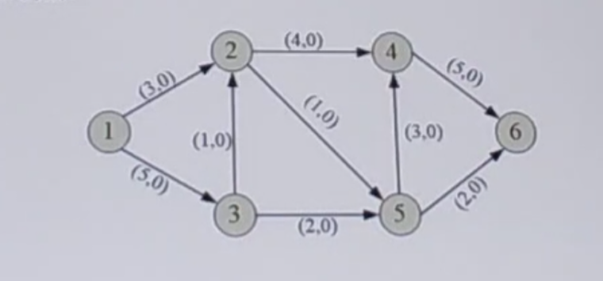

网络是指一张特殊的有向图，图中每条边(u,v)∈E都有一个容量cap，记为c(u,v)。如果
$(u,v)\notin E$，可以将c(u,v)视为0。图中还有两个特殊的点:源点s和汇点t。
在一张网络G中，流是一个从边集E到整数集或实数集的函数，这里先给出流的概念/定义，读者在
网络流的学习中会更加深刻地体会到什么是流。形象化的讲，你可以认为从源点s会流出一些流量，
通过图上的边，最终流入t，就像水流一样。流则指的就是这条“水流”。
流的性质：
1. 对于图G中每条边(u,v)∈E的流量f(u,v)表示从这条边流经了多少流量，其中0<
f(u,v)＜c(u,v)，即从该条边流过的流量的不能超过该条边的容量。
2. 对于图上任意一个节点u，设流入的流量为$in_u$，流出的为$out_u$，如果u不是源汇点（中间点），
那么。$in_u=out_u；in_s=0，out_t=0，out_s=in_t$即从s流出的流量全部会流入t，不会留在中间点。
增广路径是一条从源点（source）到汇点（sink）的路径，该路径在残余网络中存在正的剩余容量。
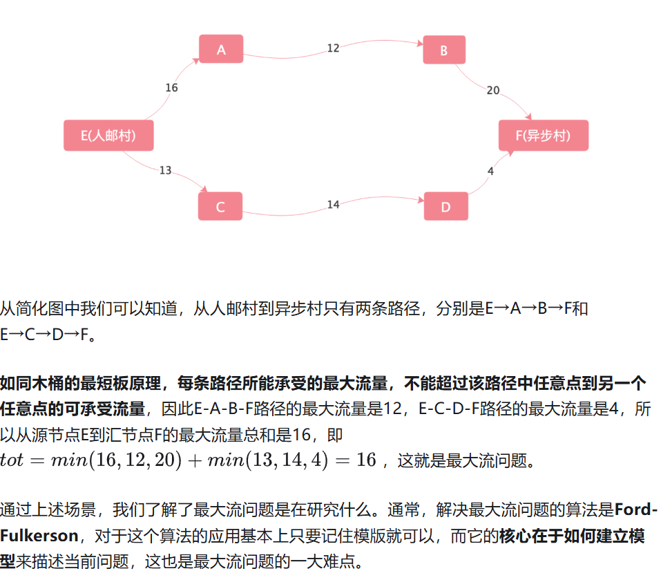
***
eg **注意 如果给的边上面有两个数字 中间逗号隔开 大的是总容量 小的是现有流量 要先重新生成剩余网络 因为边上的流不是0**
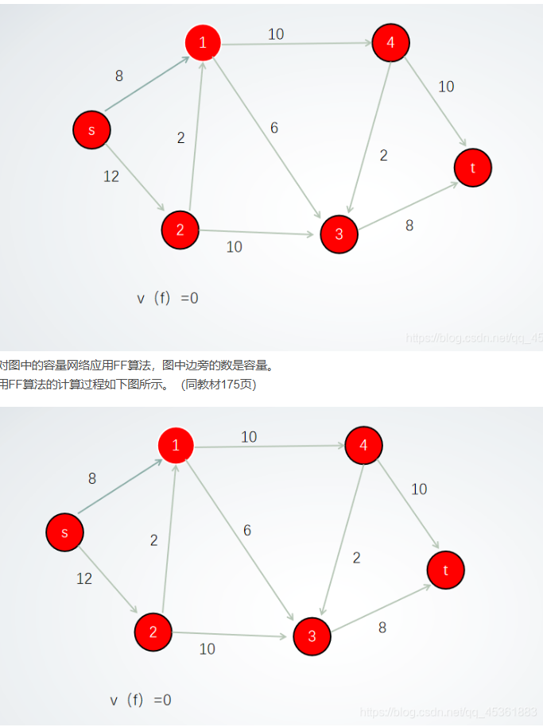

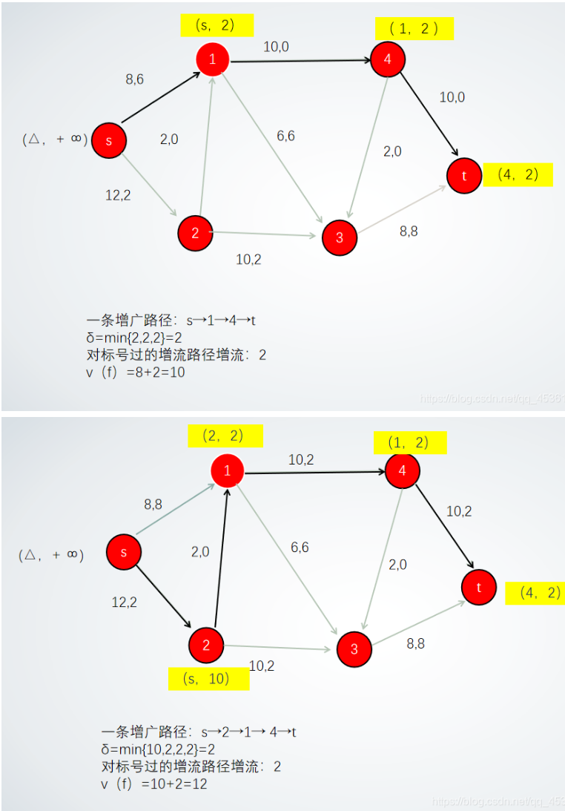
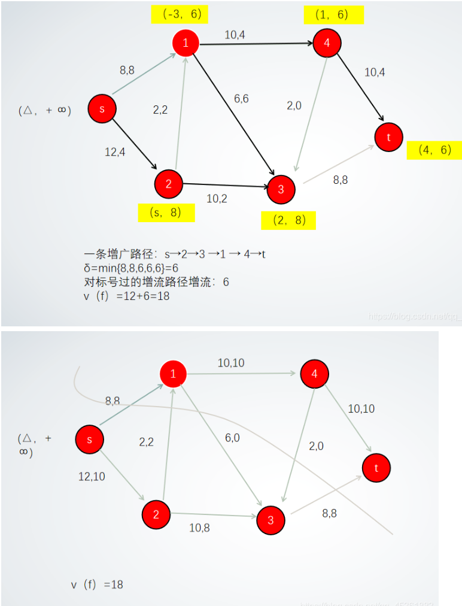

## T5 程序设计 
题目：n后问题（N-Queens Problem）

n后问题是一个著名的问题，它要求在一个 n×n 的棋盘上放置 n 个皇后，使得任何两个皇后都不能相互攻击。皇后可以攻击同一行、同一列或同一对角线上的任何位置。该问题的目标是找到所有可能的放置方案。

算法策略的思想
解决 n 后问题的一种常用算法是回溯法。回溯法是一种通过试错来解决问题的方法。它尝试分步解决一个问题，如果在某个步骤中发现之前的选择不能导致问题的解决，就回退到上一步，撤销之前的选择，再尝试其他可能的选择。

• 初始化：
• 创建一个 n×n 的棋盘，用 0 表示没有皇后，用 1 表示有皇后。
• 初始化一个数组`queens`来记录每一行皇后的列位置。
• 递归函数`placeQueen(row)`：
• 该函数尝试在棋盘的第`row`行放置一个皇后。
• 遍历所有列，检查在当前列放置皇后是否合法（即不与已放置的皇后在同一列或对角线上）。
• 如果找到合法位置，则在该位置放置皇后，并递归调用`placeQueen(row + 1)`尝试放置下一行的皇后。
• 如果在第`row`行找不到任何合法位置，或成功放置了第 n 行的皇后，则回溯，即撤销这一行皇后的放置，尝试其他列。
• 检查合法性`isSafe(row, col)`：
• 在尝试在`(row, col)`位置放置皇后时，检查是否与已放置的皇后冲突。
• 检查当前列是否已经有皇后。
• 检查左上对角线是否已经有皇后。
• 检查左下对角线是否已经有皇后。
• 打印解决方案：
• 当成功放置了第 n 行的皇后时，打印或返回当前棋盘的配置作为解决方案。
• 主函数：
• 调用`placeQueen(0)`从第一行开始递归放置皇后。
示例代码（Python）
```python
def solveNQueens(n):
    def isSafe(row, col):
        for i in range(row):
            if queens[i] == col or \
               abs(queens[i] - col) == abs(i - row):
                return False
        return True

    def placeQueen(row):
        if row == n:
            printSolution()
            return
        for col in range(n):
            if isSafe(row, col):
                queens[row] = col
                placeQueen(row + 1)
                queens[row] = -1  # 回溯

    def printSolution():
        for i in range(n):
            for j in range(n):
                if queens[i] == j:
                    print("Q ", end="")
                else:
                    print(". ", end="")
            print()

    queens = [-1] * n  # 初始化皇后位置数组
    placeQueen(0)  # 从第一行开始放置皇后

# 调用函数
solveNQueens(4)
```
这段代码定义了一个`solveNQueens`函数，它使用回溯法解决 4 后问题，并打印所有可能的解决方案。对于更大的 n，只需调用`solveNQueens(n)`即可。

下面是使用 C++实现的 n 后问题（N-Queens Problem）的解决方案，采用回溯法策略：
```cpp
#include <iostream>
#include <vector>

class NQueens {
public:
    std::vector<std::vector<char>> board;
    int size;
    std::vector<std::vector<std::vector<int>>> solutions;
    
    NQueens(int n) : size(n), board(n, std::vector<char>(n, '.')) {}

    void solveNQueens() {
        std::vector<int> cols(size, 0);
        std::vector<int> diag1(2 * size, 0);
        std::vector<int> diag2(2 * size, 0);
        backtrack(0, cols, diag1, diag2);
    }

    bool backtrack(int row, std::vector<int>& cols, std::vector<int>& diag1, std::vector<int>& diag2) {
        if (row == size) {
            solutions.push_back(board);
            return true;
        }

        for (int col = 0; col < size; ++col) {
            if (cols[col] == 0 && diag1[row - col + size] == 0 && diag2[row + col] == 0) {
                board[row][col] = 'Q';
                cols[col] = 1;
                diag1[row - col + size] = 1;
                diag2[row + col] = 1;

                if (backtrack(row + 1, cols, diag1, diag2)) {
                    return true;
                }

                board[row][col] = '.';
                cols[col] = 0;
                diag1[row - col + size] = 0;
                diag2[row + col] = 0;
            }
        }

        return false;
    }

    void printSolutions() {
        for (const auto& solution : solutions) {
            for (const auto& row : solution) {
                std::cout << std::string(row.begin(), row.end()) << std::endl;
            }
            std::cout << std::endl;
        }
    }
};

int main() {
    int n = 8; // 可以更改为任何需要的棋盘大小
    NQueens nQueens(n);
    nQueens.solveNQueens();
    nQueens.printSolutions();
    return 0;
}
```
代码说明：
• 类定义：
• `NQueens`类包含棋盘大小`size`，棋盘`board`，以及所有解决方案`solutions`。
• `board`是一个二维字符数组，用于存储棋盘状态，其中'.'表示空，'Q'表示皇后。
• 构造函数：
• 初始化棋盘大小和棋盘状态。
• solveNQueens：
• 初始化列`cols`，对角线`diag1`和`diag2`的数组，用于标记列和对角线上是否有皇后。
• 调用`backtrack`函数从第 0 行开始放置皇后。
• backtrack：
• 递归函数，尝试在第`row`行放置皇后。
• 检查当前列和对角线是否安全。
• 如果安全，则放置皇后并递归调用`backtrack`放置下一行的皇后。
• 如果放置失败，则回溯，撤销放置。
• printSolutions：
• 打印所有找到的解决方案。
• main 函数：
• 创建`NQueens`对象，调用`solveNQueens`和`printSolutions`函数。
这个程序将输出所有可能的皇后放置方案。对于更大的棋盘大小，只需更改`main`函数中的`n`值即可。
