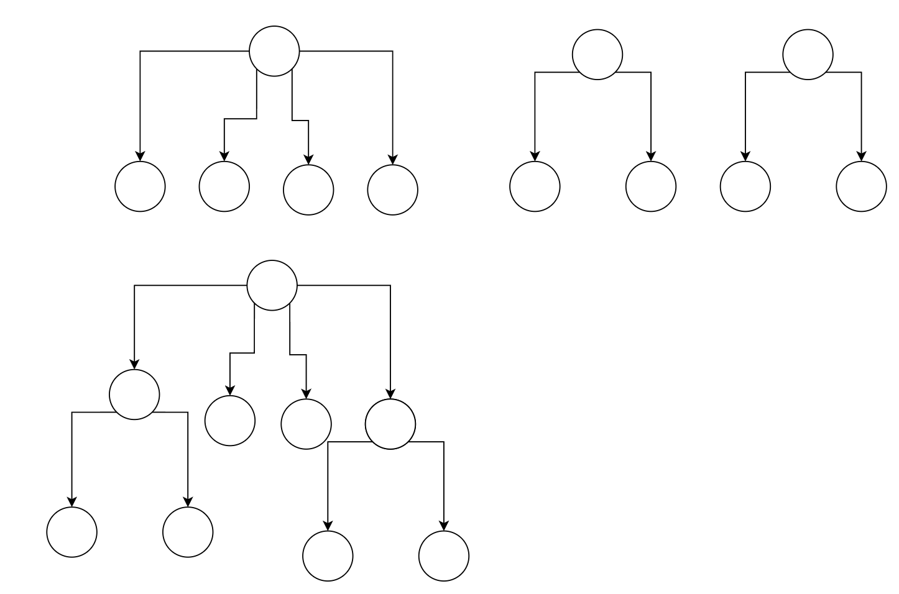
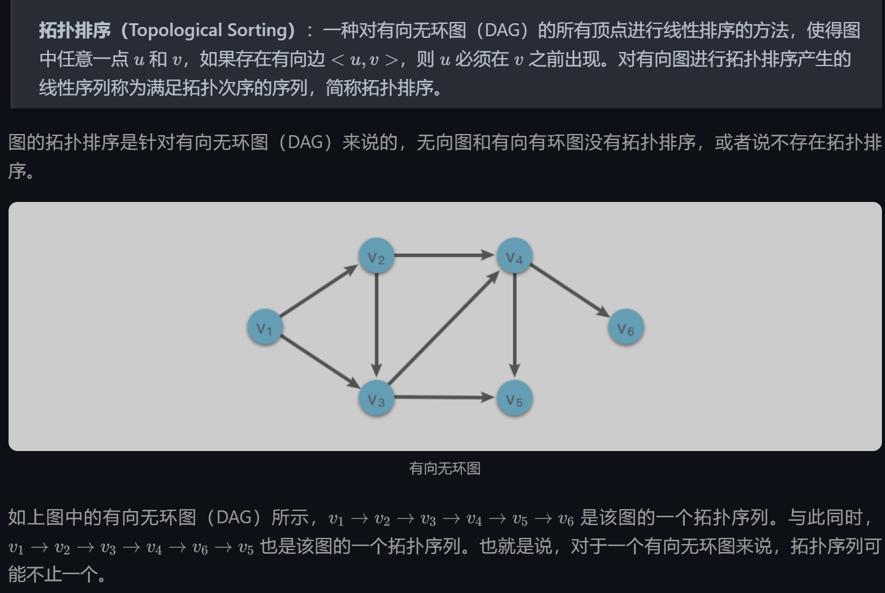
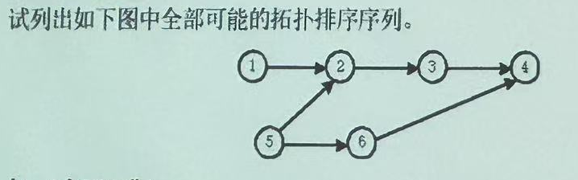

# 大题一
## (1)
Huffman树的叶子结点数为m,则结点总数为 2m - 1 
哈夫曼树的构造 看前一份定义 
注意构造哈夫曼树的时候给定的元素一定是叶子结点

## (2)
注意审题即可 问的是出栈序列不是出栈后生成的字符串

## (3)
这个自己构造关系即可

比如现在有一个度为4的结点，两个度为2的结点
最大可以有的叶子结点数为 $4*1 + 2*2 = 8$个
但是这些都是在同一颗树上的 所以别作运算
注意到 把 度为2的结点并入主树的时候，可以看作原来的结点增加了 $2 - 1 = 1$个结点。同时，度大于1的结点的子节点树是不受影响的。那即是说，对于给定的n个结点， 先选出一个度大于一的结点$n_0$,记其度为$k_0$，计算叶子节点的总数只需要把剩下所有结点的度减一再求和，再加上$k_0$即可。
答案选B

## (4) 数组在内存中是按列存储的

## (7) 对线性表进行二分法查找的前提条件是：线性表必须以顺序方式存储，并且已按关键码值排好序

## (8) 辅助空间看前一份第一页的那张表

## (10) 一维数组的例子可以看前一份 一维数组是可以存完全二叉树的，这也涉及到完全二叉树是怎么定义的

# 第四大题 树的遍历方法
深度优先搜索（DFS）
前序遍历
中序遍历
后序遍历

广度优先搜索（BFS）
层次遍历


## 第六大题



1. 顺序:5, 1, 2, 3, 6, 4
2. 顺序:5, 1, 2, 6, 3, 4
3. 顺序:1, 5, 2, 3, 6, 4
4. 顺序：1, 5, 2, 6, 3, 4

## 第七大题 
在二叉树的结点的先序序列，中序序列和后序序列中， 所有**叶子节点**的先后顺序都相同。
由于在所有这三种遍历中，叶子节点都是在访问完它们的父节点之后立即被访问，且叶子节点没有子节点，因此它们总是在遍历过程中最后被访问。这就保证了在不同的遍历序列中，叶子节点的先后顺序是相同的。

## 第九大题 
看模拟题五第二大题 主要是记名字
试画出表达式(a+b/c)*(d-e*f)的二叉树表示
```
         *
        L R
      +  -
     L R  L R
    a  /   d  e
       L R   *
      b   c   f

```
波兰式(前缀表达式) :  * + a / b c - d * e f 
逆波兰式(后缀表达式) : a b c / + d e f * - *

## 第十大题
在二叉树中，叶子节点（Leaf Node）是指没有子节点的节点。以下是一个使用 C++编写的递归算法，用于计算以二叉链表作为存储结构的二叉树中的叶子节点数目。

首先，我们定义二叉树的节点结构：


```cpp
struct TreeNode {
    int val;
    TreeNode *left;
    TreeNode *right;
    TreeNode(int x) : val(x), left(nullptr), right(nullptr) {}
};
```


然后，我们编写递归函数来计算叶子节点的数目：


```cpp
int countLeaves(TreeNode* node) {
    // 基本情况：如果当前节点为空，返回0
    if (node == nullptr) {
        return 0;
    }
    
    // 如果当前节点的左右子节点都为空，那么它是一个叶子节点
    if (node->left == nullptr && node->right == nullptr) {
        return 1;
    }
    
    // 递归计算左子树和右子树的叶子节点数目
    int leftLeaves = countLeaves(node->left);
    int rightLeaves = countLeaves(node->right);
    
    // 返回左右子树叶子节点数目之和
    return leftLeaves + rightLeaves;
}
```


最后，我们可以在`main`函数中测试这个算法：


```cpp
#include <iostream>

int main() {
    // 创建一个示例二叉树
    //       1
    //      / \
    //     2   3
    //    / \   \
    //   4   5   6
    TreeNode* root = new TreeNode(1);
    root->left = new TreeNode(2);
    root->right = new TreeNode(3);
    root->left->left = new TreeNode(4);
    root->left->right = new TreeNode(5);
    root->right->right = new TreeNode(6);

    // 计算叶子节点数目
    int leafCount = countLeaves(root);
    std::cout << "Number of leaf nodes: " << leafCount << std::endl;

    // 释放内存（这里省略了详细的内存释放代码，实际应用中需要小心处理）
    delete root->left->left;
    delete root->left->right;
    delete root->right->right;
    delete root->left;
    delete root->right;
    delete root;

    return 0;
}
```


这段代码首先创建了一个示例二叉树，然后调用`countLeaves`函数来计算并打印叶子节点的数目。最后，它释放了分配的内存。在实际应用中，内存管理需要更加小心，以避免内存泄漏。